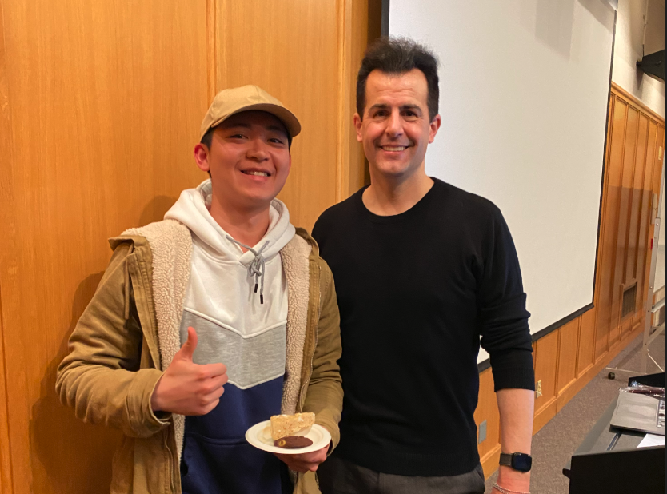

# Bo Pan

Hey there! My name is **Bo**. I believe cybersecurity is a **human service**: making people feel safe is the foundation of our digital world. I fulfill this mission by applying my technical skills to protect others while committed to continuous learning. As a Cybersecurity student graduating in March 2026, I am seeking a **SOC Analyst** or **Help Desk** role where I can contribute to a secure environment and support the people within it.

## Technical Expertise:
- **SIEM & Detection Platforms**: Splunk, Kibana, Wazuh
- **Tools**: Linux, Git, Wireshark, Powershell
- **Analytical Skills**: Phishing, Network Traffic, Web Security, Linux, Windows, SIEM Triage
- **Certification**: Google Cybersecurity Certification | TryHackMe SOC Level1 (in progress) | TryHackMe AoC 2025
- **Programming Language**: Python, Java, C++, SQL, Javascript 

## Project Highlight: 
- [Network Security & Traffic Analysis](https://bopann.github.io/bo-cyber-logbook/cyber-articles/wazuh-virus-total.html) - Linux, Pi-hole, Networking, Virtual Machine, Networking
    •	Engineered a centralized DNS filtering gateway using Pi-hole on a Debian Linux environment to proactively neutralize C2 (Command & Control) callbacks and phishing domains.
    •	Hardened network defenses by implementing blackhole routing for malicious domains, resulting in a 30% reduction in telemetry noise and a 100% block rate for known malicious web traffic.

> Problem I Solved: We all make mistakes sometimes, don’t we? In the case where I accidentally download a malicious file, Wazuh automatically checks it with VirusTotal and takes action by removing it.

- [Security Monitoring & Automation](https://bopann.github.io/bo-cyber-logbook/sinkhole/) – Wazuh, VirusTotal
    •	Enhanced endpoint visibility by deploying File Integrity Monitoring (FIM) across critical directories, ensuring 100% detection of unauthorized system changes and configuration drift.
    •	Reduced incident response time by engineering an automated integration between Wazuh SIEM and VirusTotal API, enabling near-instantaneous identification and quarantine of malicious files.

> Problem I Solved: It doesn’t take a psychology degree to know that humans love clicking links—sometimes on purpose, sometimes by accident. When that happens, Pi-hole steps in and goes, “Hmm… I don’t know about that.” It filters malicious DNS queries and helps keep my home environment safer.

## More of Me
In my free time, I like tackling **CTF challenges** — I see them as fun puzzles that sharpen my skills. You’ll find some of my CTF journeys (and struggles!) documented here.

Outside of tech, I love **shooting hoops**, **working out**, **hiking**, and **reading** about topics like health, mindfulness, and fiction. I’m also a huge fan of _The Office_ — I watch clips on YouTube all the time, and who knows, maybe I’ll join an Office trivia night someday! 😄

> “I’m not superstitious, but I am a little stitious.” — _Michael Scott_

Here is me and the one and only Prof. David J. Malan from Harvard CS50, who has been the inpiration in my learning journey.

  
